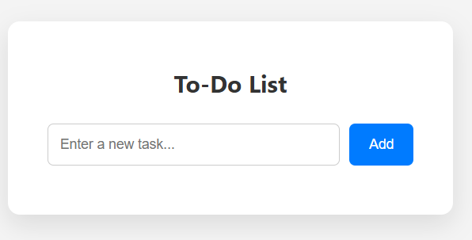
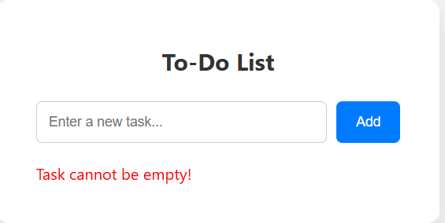
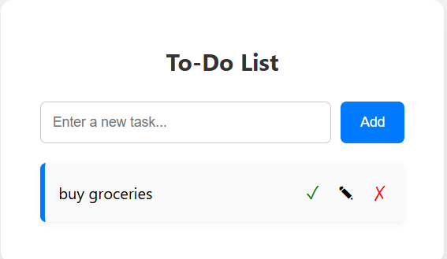
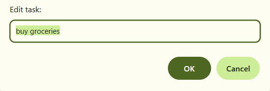
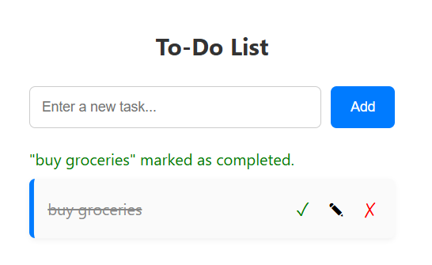
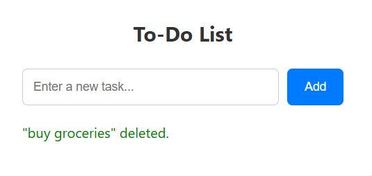
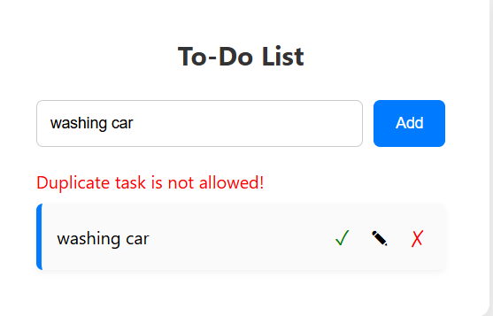

# To-Do List App

A simple and responsive To-Do List application built with **HTML**, **CSS**, and **JavaScript**.

---

## Features

- Add new tasks with validation (no empty or duplicate tasks)
- Mark tasks as completed with a completion message
- Edit existing tasks with duplicate check
- Delete tasks
- Persistent storage using `localStorage` (tasks saved on page reload)
- User-friendly inline error and status messages

---
## Usage
Type your task in the input box.

Click Add to add the task to the list.

Use the ✓ button to mark a task as completed.

Use the ✎ button to edit a task.

Use the ✗ button to delete a task.

## Screenshot









---
Technologies Used
HTML5

CSS3

JavaScript (ES6+)

Tools Used

Visual Studio Code

Git & GitHub

Google Chrome

GitHub Pages

## Demo


Try the live demo here: [To-Do List App Demo](https://ImYash-J.github.io/to-do-list)
---

## Installation

1. Clone the repository:
   ```bash
   git clone https://github.com/ImYash-J/to-do-list.git

